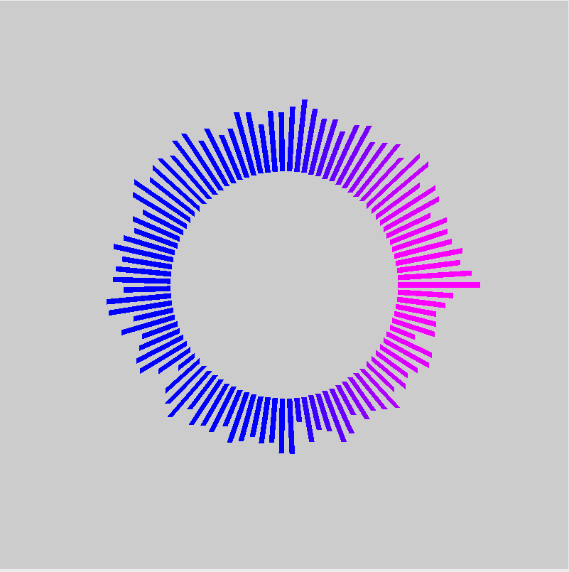
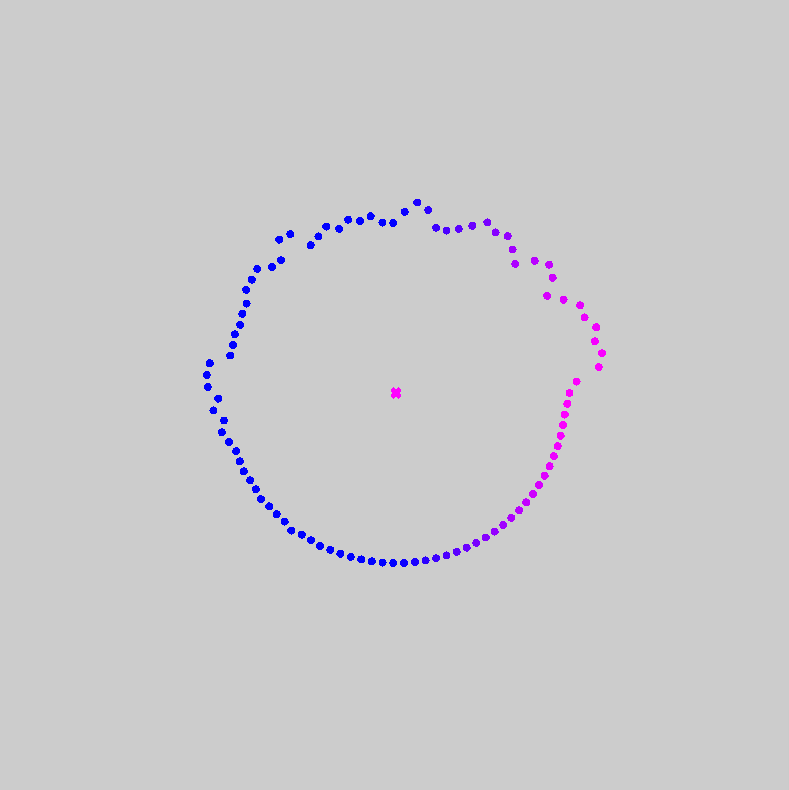
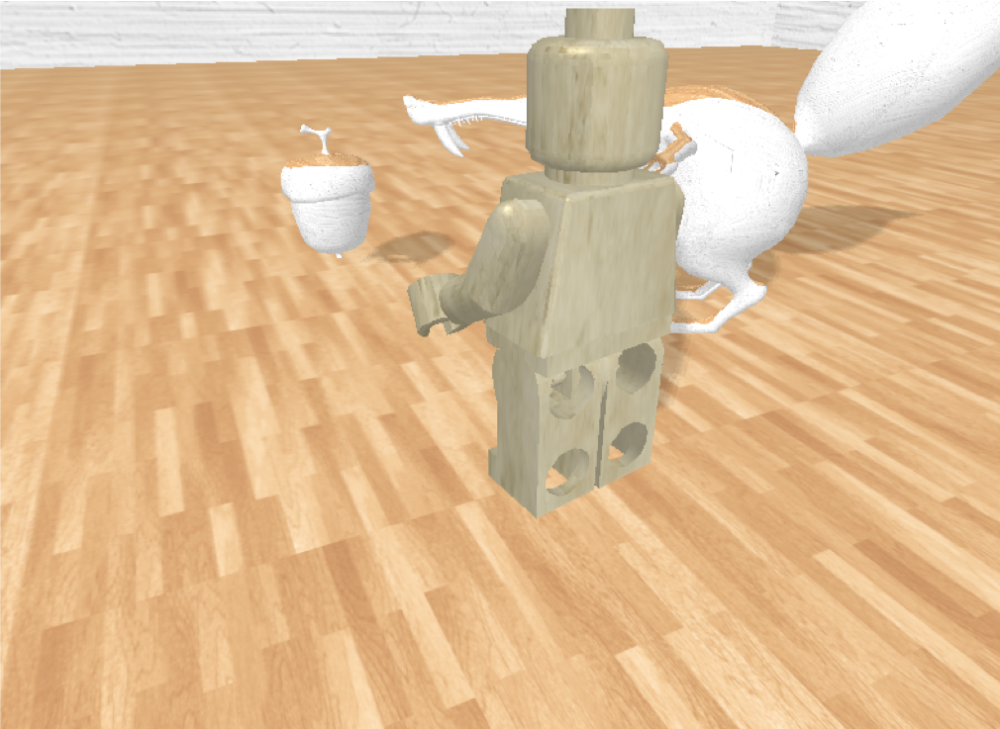
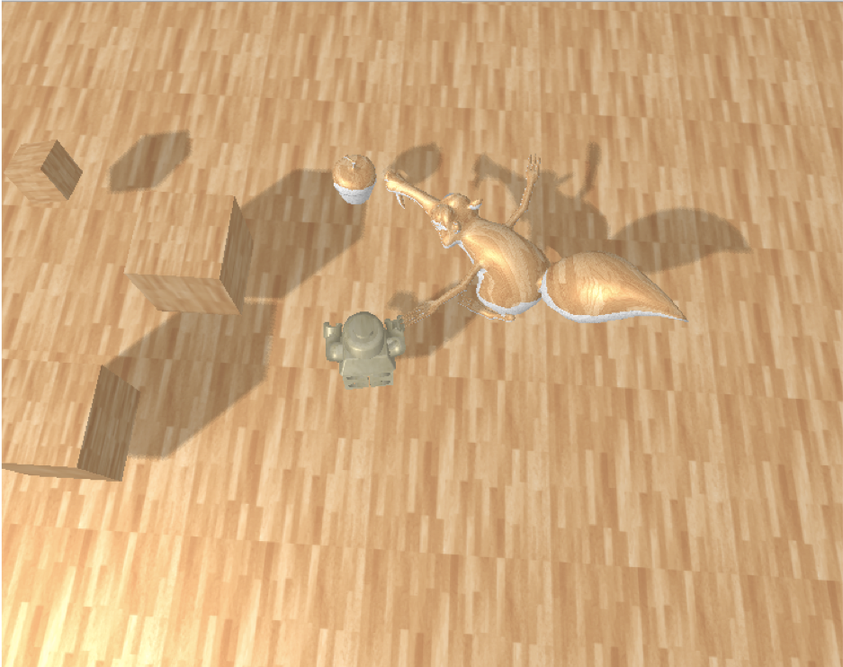
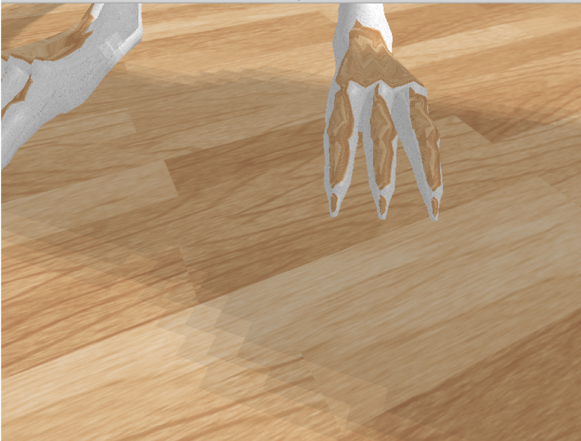

### 计算机图形学期末项目

---

#### 任务一 音乐可视化

- 已有python的开发环境

  - 运行如下初始化命令

    `pip install PyQt5
    pip install pyopengl
    pip install librosa`

  - 初始化完成后运行指令

    `cd Mission 1`

    `python music.py [music_file_path] -pitch1|-pitch2|-tempo -l/-s`

    `-pitch1`：显示音乐的cqt特征

    `-pitch2`：显示音乐的梅尔到频系数特征

    `-tempo`：显示音乐的节拍图特征

    `-l`使用条形图的显示模式

    

    `-p `使用粒子的显示模式

    

---

#### 任务二 真实感图形绘图

- C++环境编译运行

  - 需要安装：SDL2，libSOIL，glew，glfw，assimp

- 在macOS系统下运行：

  - 选择 Mission 2/MacOS/Graphics.dmg，安装并运行
  - 支持：系统版本号> MacOS 10.0

- 实现效果：

  

  

  

---

#### 任务三 动画制作

-  打开 `/Mission_3/milkbox.html`

- 实现效果：一只走路的牛奶盒

  

  